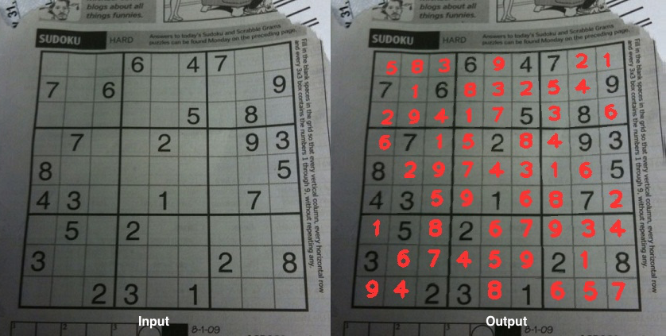

# Sudoku Solver

A project to create a Sudoku solver from images for educational purposes to explore themes of:

* Puzzle Solving Algorithms
* Computer Vision
* Machine Learning


The `Sudoku` class can take images as an input and produce solved puzzles as an output. Output can be as a formatted string, dictionary or overlayed on the original image.

```python
from Sudoku import Sudoku

example = Sudoku('data/images/grid/all/0.jpg')
example.show_completed()
```



**Current Accuracy:**

The best model and strategy (using `raw` classification) has achieved 99.2% success across 130 images (see `data/images/grid/all`). That's a single board failure with 0.05% failure rate on individual digits.


## Modules/Folders

* `Sudoku`: Main class that uses all of the modules to extract Sudoku boards from images and solve them. Has numerous display functions for viewing the output.
* `computer_vision`: Module for image processing, used to identify extract the Sudoku grid from an image.
* `data`
    * `best-model`: The current best neural network, version controlled. All other models are ignored from version control for brevity.
    * `datasets`: Pickle files with the image data stored as separated training and test sets. Version controlled so others can train equivalent models.
    * `images`: Sudoku board photographs for training and testing. The full set is version controlled, but training/test splits are not. Also contains the individual digits that have been extracted and classified, but these are not version controlled.
    * `models`: Tensorflow checkpoints of each type of model that was tested. These are not version controlled.
    * `puzzles`: Sudoku puzzles in string format, for unit tests.
    * `run-history.xlsx`: Record of previous runs for different models along with their performance in terms of speed and accuracy.
* `helper`: Module tying a lot of the functionality together, providing functions to generate datasets for training and analysing performance over the image archive.
* `neural_net`: Tensorflow module containing a convolutional neural network for digit recognition. Also has a helper class for creating usable input datasets from images.
* `solver`: Puzzle solving module, broadly a reimplementation of Peter Norvig's [solution](http://norvig.com/sudoku.html), with additional functions for handling input and printing output.
* `tests`: Unit tests for the project, including tests for puzzle solving, model training, digit recognition and board recognition.

## Choosing a Classification Modes

`config.ini` contains a single parameter, **Classification Mode**, which determines which processing mode should be used to process and recognise the Sudoku grid from the image. Note that they all use the same algorithm to actually solve the game, this only affects vision and recognition.


Example of `config.ini`:

```
[CLASSIFICATION]
Mode=raw
```

The classification mode will affect both the processing used on the image as well as the model used for training and recognition. These will need to match, otherwise the model will perform poorly. By default, the `Sudoku` method uses the model stored in `data/best-model` regardless of which classification mode it's none. You should pass a different model to the `Sudoku` constructor when changing classification modes:

```python
import helper
from Sudoku import Sudoku

# helper.classification_mode()  will fetch the mode from config.ini. model.ckpt is the default name used in the training functions.
my_model = os.path.join('data', 'models', helper.classification_mode(), 'model.ckpt')
example = Sudoku('data/images/grid/all/0.jpg', model_path=my_model)
```

Most of the high level functions are subject to the classification mode chosen. Notably anything that saves files (images, models etc.) will save in a subdirectory related to the classification mode. This makes it easy to switch between modes for easy comparisons. The main exception to this is the `best-model` directory, which is trained using the `raw` mode.

### Classification Modes

The following are key words that can be used for implementing different processing methods and hence recognition models. Many of these key words can be used in

* `basic`: Simplifies heuristics for extracting the Sudoku board out of the image. This speeds up processing but reduces reliability. This matches the implementation described in the [blog](https://medium.com/@neshpatel/solving-sudoku-part-ii-9a7019d196a2). This *excludes* the following heuristics:
    * Excluding the border width of the grid when extracting a board.
    * Using a second algorithm for board extraction in certain cases.
    * Using Hough lines and linear algebra when estimating the grid.
    * Adaptive thresholding applied on the whole board instead of on a cell-by-cell basis.
    * Using Sudoku rules to determine failures in recognition and compensating.
* `cell`: Applies a pre-processing mode to each cell but does not perform digit extraction and scaling.
* `digit`: This implements an extractor algorithm on each cell that attempts to get the digit, isolate it and scale it. Should be used with a pre-processing mode that converts the image to binary (either pure black or white).
* `raw`: This uses the full heuristics for board extraction and grid estimation but performs no pre-processing on the individual cells.

The following modes can be used in conjunction with `cell` and `digit` and will pre-process each cell before attempting digit extraction. This can affect the the model learning and recognition capability.

* `blur`
* `adaptive`
* `otsu`

#### Examples

* `digit-basic`: Easiest to understand, but not as reliable.
* `digit-adaptive-blur`: A considerable improvement over `digit-basic`.
* `raw`: Best mode once the model is sufficiently trained.


# Examples

Parse an image of a Sudoku board and solve it:

```python
from Sudoku import Sudoku

example = Sudoku('my_sudoku.jpg')
print(example.solution)
example.show_completed()
```

---

Test entire image archive:

```python
import helper

results = helper.test_board_recognition()
```

---

Randomly split the image archive into training and test sets, with 80 images chosen for the training set. From this create archives of individual digits, classified using the `.dat` files and separated into their own folders (`/data/images/classified/0-9). Finally compiles these images into a binary [pickle](https://docs.python.org/3/library/pickle.html) file that can be consumed for training. The last line trains a model using this dataset binary.

> The `auto_classify` function won't overwrite files, it will just keep adding more training (or testing) data.

```python
import helper

helper.random_train_test(80)  # Randomly splits the total archive into a training and test.
helper.auto_classify(dry=False)  # Classifies digit images using .dat descriptors without manipulation.
helper.create_from_train_test()  # Creates a pickled data file from classified digit images for training.
helper.train()  # Trains a neural network using the given classification mode and this dataset.
```

---

Randomly manipulate the digit images computationally using [`imgaug`]() and classify them using the `.dat` files.

```python
import helper
from imgaug import augmenters as iaa

# Define randomised image augmentations to perform when classifying the data
seq = iaa.Sequential([
    iaa.Crop(px=(2, 5)),  # Crop images from each side by 0 to 4px (randomly directions)
    iaa.Pad(px=(0, 4)),  # Pad images for each side by 0 to 4px (random directions)
    iaa.GaussianBlur(sigma=0.5),  # Gaussian blur with a kernel of size sigma
    iaa.Dropout(p=0.2),  # Adds randomised pixel dropout
    iaa.PerspectiveTransform(scale=0.075, keep_size=True)
])

helper.auto_classify(train_only=True, imgaug_seq=seq, dry=False)  # Manipulation using imgaug
helper.create_from_train_test()  # Creates a pickled data file from classified digit images for training.
```

---

Randomly manipulate the digit images computationally using custom functions defined in `computer_vision/augment.py` and classify them using the `.dat` files.

```python
import helper
import computer_vision.augment as augment_fns

helper.auto_classify(train_only=True, aug_fn=augment_fns.contrast, dry=False)  # Custom manipulation
helper.create_from_train_test()  # Creates a pickled data file from classified digit images for training.
```